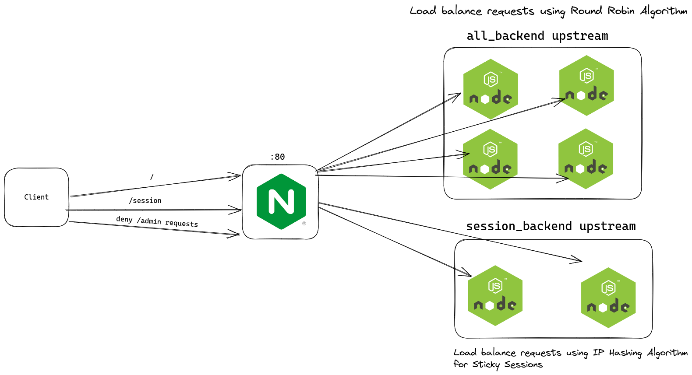

## Nginx as a Layer 7 proxy

Build `nodeapp` image:
```shell
docker build . -t nodeapp
```

I have created a docker-compose configurations that spin up 4 instances of nodeapp image and an Nginx instance:
```yaml
version: '3'

services:
  nginx:
    container_name: nginx-load-balancer
    image: nginx
    ports:
      - "80:80"
    volumes:
      - ./nginx.conf:/etc/nginx/nginx.conf
    depends_on:
      - nodeapp1
      - nodeapp2
      - nodeapp3
      - nodeapp4
    networks:
      - app-network

  nodeapp1:
    hostname: 'nodeapp1'
    container_name: nodeapp1
    image: nodeapp
    environment:
      - APPID=2222
    ports:
      - "2222:9999"
    networks:
      - app-network

  nodeapp2:
    hostname: 'nodeapp2'
    container_name: nodeapp2
    image: nodeapp
    environment:
      - APPID=3333
    ports:
      - "3333:9999"
    networks:
      - app-network

  nodeapp3:
    hostname: 'nodeapp3'
    container_name: nodeapp3
    image: nodeapp
    environment:
      - APPID=4444
    ports:
      - "4444:9999"
    networks:
      - app-network

  nodeapp4:
    hostname: 'nodeapp4'
    container_name: nodeapp4
    image: nodeapp
    environment:
      - APPID=5555
    ports:
      - "5555:9999"
    networks:
      - app-network

networks:
  app-network:
    driver: bridge
```

For NGINX configurations:
```nginx
http {
    upstream all_backend {
        # defualt algorithm is round robin
        server nodeapp1:9999;
        server nodeapp2:9999;
        server nodeapp3:9999;
        server nodeapp4:9999;
    }
    
    upstream session_backend {
        # use ip_hash balancing algorithm -> useful for sticky sessions;
        ip_hash;
        server nodeapp1:9999;
        server nodeapp2:9999;
    }


    server {
        listen 80;
        server_name localhost;
        location / {
            proxy_pass http://all_backend;
        }

        location /session {
            proxy_pass http://session_backend/;
        }

        location /admin {
            return 403;
        }
    }
}
events{}
```
We set up two upstream blocks, `all_backend` and `session_backend`. The first block includes four instances of `nodeapp` and uses the default round-robin load balancing algorithm, while the second block includes two backend servers and uses the `ip_hash` algorithm for sticky sessions. The configuration also defines a server block that listens on port 80, proxies requests to the "all_backend" and "session_backend" blocks, and returns a 403 error for requests to the "/admin" location block.

**Overview Architecture:**
