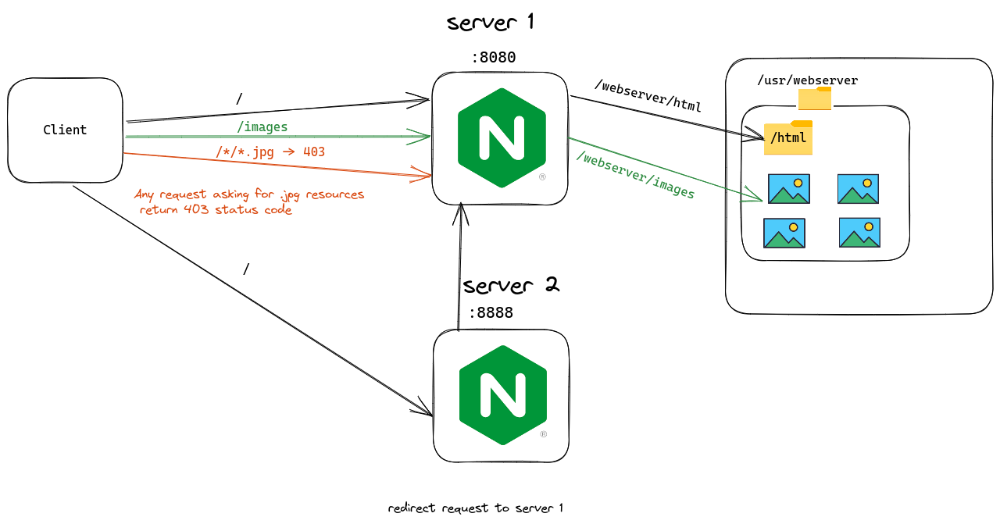

# Nginx as a Web Server

##### NGINX Web server Configurations:
This NGINX configuration listens on two different ports and performs different tasks for each. The first server serves static files from a directory and denies requests for JPEG files. The second server acts as a reverse proxy, forwarding requests to the first server. This configuration can be used to load balance or scale web applications and improve performance and reliability.
```nginx
http {
    server {
        listen 8080;

        root /usr/webserver/html;

        location /images {
            root /usr/webserver/;
        }

        location ~ .jpg$ {
            return 403;
        }
    }

    server {
        listen 8888;

        # Layer 7 proxy -> redirect to http://localhost:8080/
        location / {
            proxy_pass http://localhost:8080;
        }
    }
}

events {}
```

##### NGINX Web Server Image:
Build a custom NGINX image that exposes ports `8080`, and `8888`
```Dockerfile
FROM nginx

RUN apt-get update && apt-get install -y vim

COPY nginx.conf /etc/nginx/nginx.conf

COPY html /usr/webserver/html
COPY images /usr/webserver

EXPOSE 8080
EXPOSE 8888

CMD ["nginx", "-g", "daemon off;"]
```


Run nginx container exposed in port 8080 and 8888
```shell
docker run --name nginx-webserver -p 8080:8080  -p 8888:8888 nginx-web-server
```


Overview Architecture:
